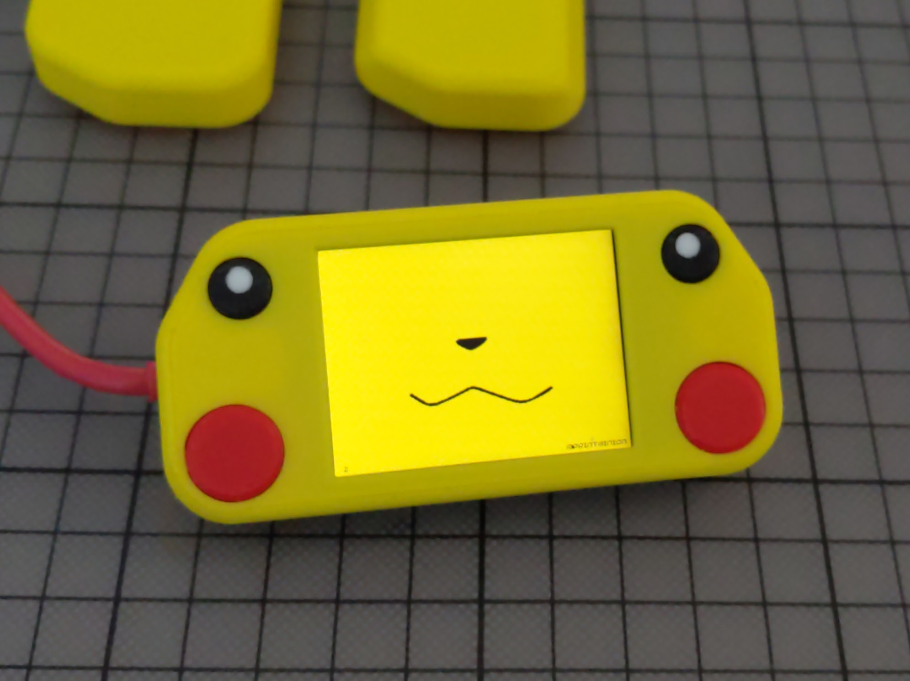

# pimoroni-pico-faces
Show large images (faces) on Pimoroni [Pico Display Pack 2.0](https://shop.pimoroni.com/products/pico-display-pack-2-0)

Inspired by [Tutorial for Raspberry Pi Pico Games using Sprites](http://www.penguintutor.com/programming/picogamesprites)

* [picochu](./picochu/README.md) - pikachu faces for [3d printed enclosure](https://cults3d.com/en/3d-model/gadget/enclosure-p2-picochu-for-pimoroni-pico-display-pack-2-0-and-raspberry-pi-pico)

You can create your own faces by converting png images to raw sprites
* [image_convert.py](image_convert.py) - convert png files to sprites