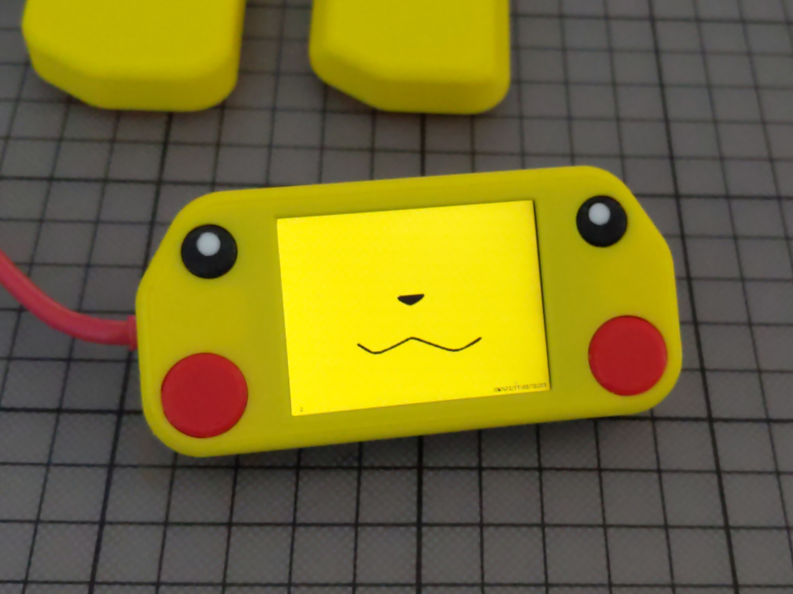

# Picochu - display pikachu faces on raspberry pico

(3d printed enclosure https://cults3d.com/en/3d-model/gadget/enclosure-p2-picochu-for-pimoroni-pico-display-pack-2-0-and-raspberry-pi-pico)
 
* Install [thonny](https://thonny.org/) and start it on your PC
* connect [Pico Display Pack 2.0](https://shop.pimoroni.com/products/pico-display-pack-2-0) with Rasperry Pi Pico
* connect raspberry pico with micro USB cable to your PC
* push stop button
* copy main.py, sprite_file.py and all picochu-sprite-*.spr files to pico
* voilà! 

You can test positioning of sprite locally without pico with [test_actor_file.py](./tests/test_actor_file.py). 
Colors are distorted but will be ok on screen. 